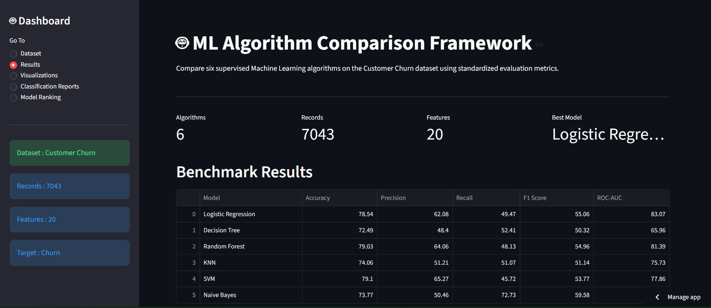

# 🤖 ML Algorithm Comparison Framework

An interactive Machine Learning benchmarking framework built using **Python, Scikit-learn, and Streamlit** to compare the performance of six supervised classification algorithms on a real-world Customer Churn dataset.

---
## 🚀 Live Demo

https://ml-algorithm-comparison-83motcllkkfydxdccsrbth.streamlit.app 

---

## 📸 Dashboard Preview

## 🚀 Features

* Compare **6 Machine Learning algorithms** on the same dataset
* Automated benchmarking using:

  * Accuracy
  * Precision
  * Recall
  * F1-Score
  * ROC-AUC
* Interactive **Streamlit dashboard**
* Confusion Matrix visualization
* ROC Curve comparison
* Precision vs Recall comparison
* Feature Importance visualization
* Model ranking based on performance
* Download benchmark results
* Saved trained models for future inference

---

## 🧠 Algorithms Compared

* Logistic Regression
* Decision Tree
* Random Forest
* K-Nearest Neighbors (KNN)
* Support Vector Machine (SVM)
* Naive Bayes

---

## 📂 Project Structure

```text
ml-algorithm-comparison/
│
├── assets/
├── classification_reports/
├── data/
├── models/
├── notebooks/
├── app.py
├── results.csv
├── requirements.txt
└── README.md
```

---

## 📊 Evaluation Metrics

The framework evaluates each algorithm using:

* Accuracy
* Precision
* Recall
* F1-Score
* ROC-AUC

---

## 💻 Installation

```bash
git clone https://github.com/harshitha121124/ml-algorithm-comparison.git

cd ml-algorithm-comparison

pip install -r requirements.txt
```

---

## ▶️ Run the Dashboard

```bash
streamlit run app.py
```

---

## 📈 Dashboard

The Streamlit dashboard provides:

* Dataset Overview
* Benchmark Results
* Model Ranking
* Performance Visualizations
* Classification Reports

---

## 🛠 Technologies Used

* Python
* Scikit-learn
* Streamlit
* Pandas
* NumPy
* Matplotlib
* Seaborn

---

## 📌 Future Improvements

* Interactive Plotly visualizations
* Hyperparameter optimization
* Support for custom datasets
* AutoML benchmarking
* Model explainability using SHAP

---

## 👩‍💻 Author

**G. R. Harshitha**

B.Tech Mechanical Engineering
Indian Institute of Technology Madras
